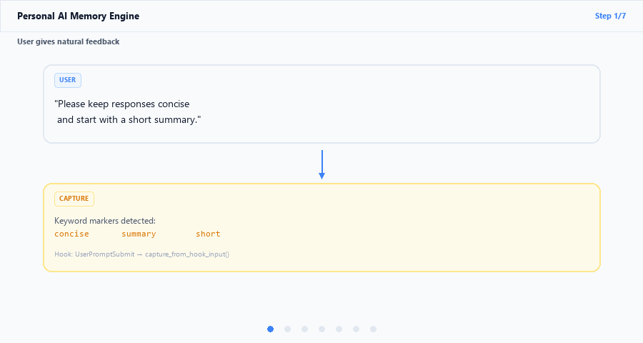
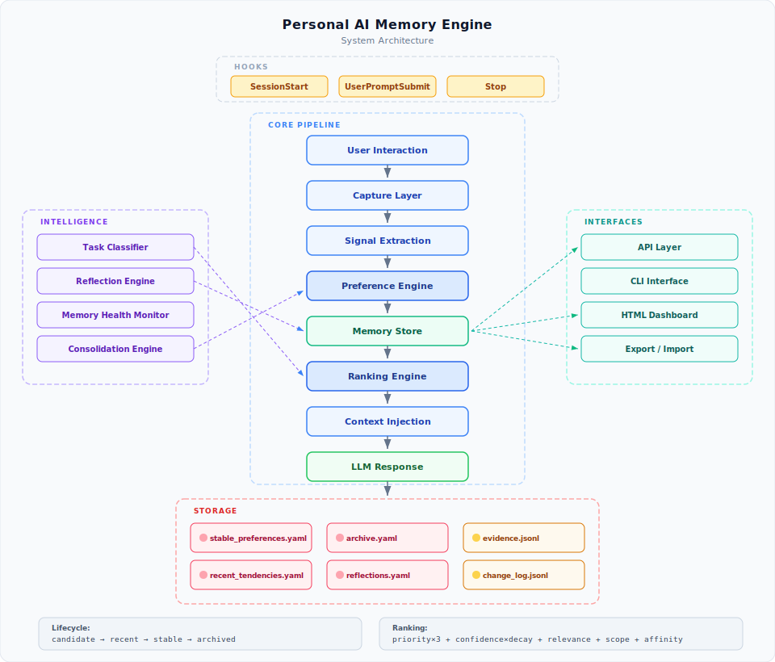

# Personal AI Memory Engine

A Claude Code hooks-based memory system that learns user preferences from interactions and injects personalized context into every session.



## Quick Start

The engine runs automatically via Claude Code hooks. No manual setup needed beyond placing the hooks in your Claude Code configuration.

### CLI

```bash
python cli.py memory health        # Memory health report
python cli.py memory list          # List active preferences
python cli.py memory search concise # Search by keyword
python cli.py memory reflect       # Generate reflections
python cli.py memory consolidate   # Run dedup + archival
python cli.py memory dashboard     # Generate HTML dashboard
python cli.py memory export out.json
python cli.py memory import out.json
```

### API

```python
from engine.api import (
    get_active_memories,
    search_memories,
    generate_reflections,
    get_memory_health_text,
    export_memory,
    import_memory,
)

memories = get_active_memories()
results = search_memories("concise")
print(get_memory_health_text())
```

## Architecture



See [docs/architecture.md](docs/architecture.md) for the full system design.

## Project Structure

```
engine/          Core modules
  api.py         Public API surface
  inject_context.py   Ranking + injection
  consolidate.py      Dedup + merge + archival
  reflect.py          Reflection synthesis
  memory_health.py    Health monitoring
  task_classify.py    Context-aware retrieval
  extract.py          Preference extraction
  update_preferences.py  Lifecycle promotion
  capture.py          Event capture
  session.py          Session tracking
  llm_analyze.py      Local LLM analysis
  engine_io.py        YAML/JSONL I/O

hooks/           Claude Code hooks
  on_session_start.py  Inject preferences + reflections
  on_prompt_submit.py  Capture + inject per prompt
  on_stop.py           Extract + consolidate + reflect + health

tools/           Utilities
  memory_dashboard.py  HTML dashboard generator
  export_memory.py     Standalone export script
  import_memory.py     Standalone import script

tests/           Test suite
  test_lifecycle.py    Archival + state machine
  test_ranking.py      Decay, scope, affinity, ordering
  test_merge.py        Synonym, fuzzy, noise, field preservation

memory/          YAML preference storage
state/           Session + evidence logs
raw/             Raw interaction events
inference/       Extracted candidates
```

## Storage

All data is stored locally in YAML and JSONL files. No external database required.

## Requirements

- Python 3.10+
- PyYAML
- pytest (for tests)
- Optional: Ollama with qwen2.5:3b (for LLM-based behavior analysis)
